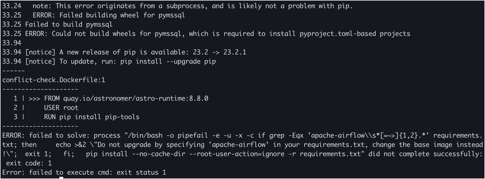

To prepare your Astro Deployment for an upgrade and preemptively resolve issues that might occur during or after an upgrade, you can use Astro CLI's [`astro dev upgrade-test`](astro-dev-upgrade-test.md) command. You can test an upgrade to a specific Airflow, Astro Runtime, or Astronomer Certified version. You can spin up a local Airflow environment using your Deployment's Astro project, test for an upgrade, and fix the issues before you deploy the changes to your Astro Deployment. By default, this command will run three tests in the following order that will generate reports to help you determine if your upgrade will be successful:

1. **Conflict test**: Identify dependency conflicts for Python packages between your current version and upgrade version.
2. **Dependency test**: Identify the packages that have been added, removed, or changed in your upgrade version.
3. **DAG test**: Identify Python `import` errors in your DAGs in your upgrade version. 

If the tests are successful, all three tests will produce a report within a sub-folder in your Astro project. The name of the sub-folder is of the format `upgrade-test-<your-current-version>--<your-upgrade-version>`. For example, if your current version of Astro Runtime is `7.6.0` and your upgrade version is `8.8.0`, your sub-folder will be `upgrade-test-7.6.0--8.8.0`.

To run all three tests against the latest version of Astro Runtime run `astro dev upgrade-test` in your [Astro Project](get-started-cli.md#step-1-create-an-astro-project).

## Test before upgrading

By default, the `astro dev upgrade-test` command runs all the three tests against the latest version of Astro Runtime. If you want to test your Astro project against a specific version of Airflow or Astro Runtime, you can use the flags `--airflow-version` or `--runtime-version` respectively. You can also choose to run only a specific test for your Astro project. See [`airflow dev upgrade-test`](astro-dev-upgrade-test.md/#options) for available options and examples.

The results of the tests appear in a new sub-folder in your Astro project, namely, `upgrade-test-<current-version>--<upgrade-version>`. This sub-folder will contain the following files based on the type of test you run:

- `conflict-test-results.txt`: The result of the conflict test.
- `pip_freeze_<current-version>`: The output of the `pip freeze` with your current Astro Runtime version.
- `pip_freeze_<upgrade-version>`: The output of the `pip freeze` with your new Astro Runtime version.
- `dependency_compare.txt`: The result of the dependency test.
- `Dockerfile`: The updated file used in the upgrade test.
- `dag-test-results.html`: The results of the DAG test.

Use the test results to fix any dependency conflicts or broken DAGs before you upgrade. Refer to the Airflow and Provider package release notes to assist in upgrading your DAGs. After you resolve all conflicts and DAG import errors, you can [upgrade Astro Runtime](upgrade-runtime.md) and deploy your project to an Astro Deployment.

Every time you rerun the test for the same upgrade all the files in the test results folder will be changed. If you’d like to keep results for a particular test run make sure to change the folder name.

:::tip

If you're testing a local project before deploying to a Deployment on Astro Hosted or Hybrid, you can test more accurately by adding  `--deployment-id` flag and specifying your Deployment ID. The Astro CLI uses the image currently running in your Deployment to test against the upgrade version. Note that this flag will use your local DAGs and dependencies against your Astro Deployment's image with the upgrade version of runtime specified. 

:::

Read the following sections to learn more about the contents of each test report. For more information about the command's settings, see the [CLI reference guide](cli/astro-dev-upgrade-test.md).

### Conflict test

When you build an Astro project, you can install additional Python packages using your project's `requirements.txt` file. These additional packages can have dependency conflicts with the other packages and the conflicts can result in [build or DAG import errors](https://docs.astronomer.io/learn/debugging-dags.md#import-errors-due-to-dependency-conflicts). This can cause your upgrade to be unsuccessful. Conflict test can help you identify these dependency conflicts before you do an upgrade by checking your `requirements.txt` and the dependencies of your upgrade version.

To run only the conflict test against the latest version of Astro Runtime, run the following command in your Astro project:

```bash
astro dev upgrade-test --conflict-test
```

The test will get the dependencies of the upgrade version and your existing dependencies from `requirements.txt`, then use [`pip compile`](https://stackoverflow.com/questions/66751657/what-does-pip-compile-do-what-is-its-use-how-do-i-maintain-the-contents-of-my) to identify the conflicts. If the command identifies a conflict it will stop and display the stacktrace along with the error. You can resolve the dependency conflict and restart the test. 

Here is an example of the logs you may see if there is a conflict:



If no conflicts identified, a report for the test, namely, `conflict-test-results.txt` is generated and saved in the `upgrade-test-<old-version>--<new-version>` sub-directory within your Astro project.

### Dependency test

When you upgrade from an existing Airflow version to a new version, either new Python packages are added, or existing packages are updated or removed. To prepare for an upgrade, it is beneficial to identify these changes beforehand and take action to ensure a stable and secure Airflow environment. Dependency check will generate a list of Airflow providers and packages that have changed between your existing version and the upgrade version. This will include packages that have been added, updated or removed and any unknown updates. If a package has been updated, the report will also contain the major, minor or patch version changes.

To run only the version test against the latest version of Astro Runtime, run the following command in your Astro Project:

```bash
astro dev upgrade-test --version-test
```

The report for the version test, namely, `dependency_compare.txt` is generated and saved in the `upgrade-test-<old-version>--<new-version>` sub-folder within your Astro project. This report contains the following sections:

- Apache Airflow Update
- Airflow Providers Major Updates
- Airflow Providers Minor Updates
- Added Airflow Providers
- Unknown Updates
- Major Updates
- Minor Updates
- Patch Updates
- Added Packages
- Removed Packages

Airflow providers with major updates are most likely to cause your DAGs to fail. Ensure that you check the [changelog](https://airflow.apache.org/docs/#providers-packagesdocsapache-airflow-providersindexhtml) for your provider if you see a major version update to understand the changes and take corrective actions. Also, pay special attention to the **Unknown Updates** section in the report. These are updates that Astro CLI could not categorize and could be major updates that can cause your DAGs to break.

### DAG test

When you upgrade from an existing Airflow version to a new version, the Python packages that have changed can cause your DAGs to break, causing `import` errors. Generally, these `import` errors are visible in the UI after you upgrade your Airflow environment. To preemptively address these, you can use the DAG tests. 

To run only the DAG test against the latest version of Astro Runtime, run the following command in your Astro Project: 

```bash
astro dev upgrade-test --dag-test
```

This test will use the [`astro dev parse`](./astro-dev-parse.md) command against the upgrade version and produce a report, called `dag-test-report.html`. This HTML report lists the DAGs that will have import errors, along with the first error encountered if you perform an upgrade. You can use this report along with the dependency-test report to fix errors in your DAGs before you run an upgrade.

## Test before upgrading using a custom image

By default, the CLI will create an updated version of your `Dockerfile` by replacing your current Astro Runtime version with the desired version in the `FROM` command. If you are pulling from a custom image in the `FROM` line in your `Dockerfile`, you can provide the new image name of the desired version of Airflow with the `--image-name` flag. The CLI will use that new image name after the `FROM` keyword and use it in the `Dockerfile`. For example, `astro dev run upgrade-test --image-name <your-new-runtime-version>`, will generate the following `Dockerfile` for upgrade tests.

```bash
FROM <your-new-runtime-version>
```

## See also

- [Debug DAGs](https://docs.astronomer.io/learn/debugging-dags.md)
- [`astro dev pytest`](./astro-dev-pytest.md)
