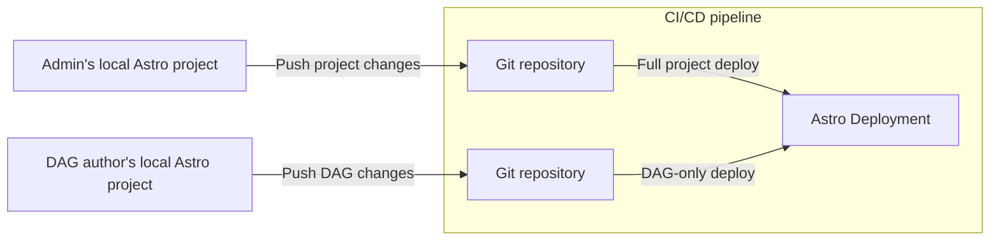
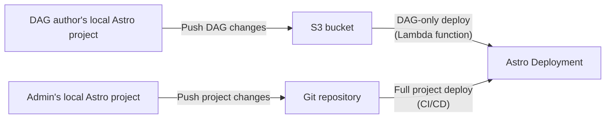

Continuous Integration and Continuous Delivery (CI/CD) pipelines are programmatic workflows that automate key parts of the software development lifecycle, including code changes, builds, and testing. CI/CD enables teams to develop faster, more securely, and more reliably.

There are many strategies for organizing your source code and building CI/CD pipelines, and each has its own benefits and limitations. Use this document to:

- Learn the benefits of CI/CD.
- Determine what kind of Deployment and CI/CD system you want your team to use.

Then, see [CI/CD templates](ci-cd.md) for setup steps and examples.

## Benefits of CI/CD on Astro

On Astro, you can use [Deployment API keys](api-keys.md) to automate your code deploys. Astronomer recommends hosting your Astro project source code in a version control tool, such as [GitHub](https://github.com/) or [GitLab](https://about.gitlab.com/), and setting up a CI/CD workflow for all production environments.

There are many benefits to configuring a CI/CD workflow on Astro. Specifically, you can:

- Avoid manually running `astro deploy` every time you make a change to your Astro project.
- Ensure that all changes to your Astro project are reviewed and approved by your team before they get pushed to Astro.
- Automate promoting code across development and production environments on Astro when pull requests to certain branches are merged.
- Enforce automated testing, which increases code quality and allows your team to respond quickly in case of an error or failure.
- Configure more granular user permissions by managing access and changes to your Astro project source code in your version control tool.

## Choose a Deployment strategy

You can set up CI/CD pipelines to manage multiple Deployments and repositories based on your team structure. The most common strategies are: 

- Single-environment: This method is the easiest way to get started with CI/CD on Astro.
- Multiple-environment: This method is best for most teams and is recommended by Astronomer.
- Bucket-based: This method is best for teams migrating from Amazon Managed Workflows for Apache Airflow (MWAA) or Google Cloud Composer (GCC).
- DAG-repository: This method is best for teams that manage all DAGs for all Astro projects in a single Git repository.

Read the following topics to learn which strategy is right for you. Advanced data teams might follow a custom CI/CD strategy that is not described here and is optimized for a particular use case or team structure. If you're not sure which CI/CD strategy is right for you, contact your customer success representative.

### Single environment

The easiest and most cost-effective way to get started with CI/CD on Astro is to maintain a single Git repository that corresponds to a single Astro project and Deployment.

This method assumes that you have:

- 1 Astro project.
- 1 Git repository with all Airflow and Astro project files.
- 1 Astro Workspace for your project.
- 1 Astro Deployment.
- 1 primary and long-living branch in your Git repository. Astronomer recommends `main`.

With this method, you can configure a CI/CD pipeline that deploys code to Astro every time a change is made to an Astro project file in your Git repository. To deploy a change to a DAG or add a new Python package:

- Test all DAG and Astro project changes locally with the Astro CLI. See [Test and troubleshoot locally](test-and-troubleshoot-locally.md).
- Create a new, short-lived branch in your Git repository with the change and open a Pull Request (PR) against the `main` branch for review.
- When the PR is approved and merged to `main`, the change is automatically deployed to your Deployment on Astro.

Running all of your data pipelines in a single environment means that you don't have to pay for the infrastructure of multiple Deployments, but it limits your ability to test changes on Astro or on development datasets before they are deployed. Astronomer does not recommend this method for production use cases.

## Multiple environments

For small to medium-sized data teams running data pipelines in production, Astronomer recommends a setup with multiple environments. With this method, you maintain 1 Git repository that hosts source code for 2 or 3 Deployments that each represent a development environment. If you work at a larger organization, you can adapt this method by creating a Workspace for each team or business use case.

The multiple environment method assumes that you have:

- 1 Astro project.
- 1 Git repository with all Airflow and Astro project files.
- 1 Astro Workspace for your project.
- 2 Astro Deployments that each correspond to a development or production environment.
- 2 primary branches in your Git repository that each correspond to an environment. Astronomer recommends `main` and `dev`.

With this method, each Deployment might also correspond to a data warehouse environment. If you use Snowflake, for example, your development Deployment on Astro can correspond to a virtual data warehouse for development (`DWH Dev`) and your production Deployment can correspond to a virtual data warehouse for production (`DWH Prod`).

### Multiple Git repositories to a single Deployment

Using multi-repository CI/CD strategy, you can manage the DAGs in one repository and project settings in another. Use this strategy to ensure that DAG authors and data operators have access only to their own files. 

One drawback to this strategy is that you must keep any local copies of the Astro project in sync with both repositories in order to test Deployment code locally. Your team members might have inconsistencies in their local environments if they can't access code changes from other team members. Astronomer recommends setting up a `dev` Deployment that your users have more access to for testing purposes. 

This strategy requires enabling [DAG-only deploys](deploy-code.md#enable-dag-only-deploys-on-a-deployment) on the target Deployment and setting up your CI/CD pipeline on both Git repositories.

### S3 bucket and Git repository to a single Deployment

Similarly to the multiple repository strategy, this strategy separates the management of DAGs and project configuration. DAGs are stored in an [S3 bucket](https://aws.amazon.com/s3/), while Astro project configuration files are stored in a Git repository. 

If you migrated to Astro from MWAA, this strategy is useful for maintaining a similar workflow for users. You can set up a Lambda function to push DAGs to your Astronomer Deployment whenever DAG files are updated in your specific S3 bucket.

## Create a CI/CD pipeline

The general process for creating an Astro CI/CD template is to:

- Decide on a CI/CD strategy based on this document and your team's needs.
- Set up your repositories and permissions based on your CI/CD strategy.
- Add one of Astronomer's [CI/CD templates](ci-cd.md) to your repositories, or use the Astronomer-maintained [`deploy-action` GitHub action](https://github.com/astronomer/deploy-action).
- Modify the template or GitHub action as needed for your use case. 

If you use GitHub, Astronomer strongly recommends using the Astronomer-maintained [`deploy-action` GitHub action](https://github.com/astronomer/deploy-action).(https://github.com/astronomer/deploy-action).

# Testing and Validating DAGs During CI/CD

You may consider validating and testing your DAG code before deploying it to your Deployment.

Astronomer provides [tooling](https://docs.astronomer.io/astro/test-and-troubleshoot-locally#test-dags-with-the-astro-cli) to validate that your DAGs do not have import or syntax errors. You can implement this parse test with the [Astro CLI](https://docs.astronomer.io/astro/cli/astro-dev-parse) or the [Deploy-Action](https://github.com/astronomer/deploy-action). The default test may not work on all DAGs, especially if they access the meta-database at runtime (a common anti-pattern). In this case, you can write your own parse test using our example pytests.

Astronomer also provides tooling to run [custom Pytests](https://airflow.apache.org/docs/apache-airflow/stable/best-practices.html#unit-tests) on your DAG code, python methods, and custom operators. The [Astro CLI](https://docs.astronomer.io/astro/cli/astro-dev-pytest) and [Deploy-Action](https://github.com/astronomer/deploy-action#example-using-pytests) will use docker to spin up a docker container that has a similar environment to your deployment and executes your Pytests. We recommend that you pytest any custom python code you use in your DAGs.

# Conclusion

Now you should know the basics of creating a CI/CD pipeline for an Astronomer Deployment. If you’d like help customizing your CI/CD pipelines for your specific use case, feel free to reach out to Astronomer support
