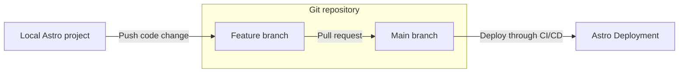
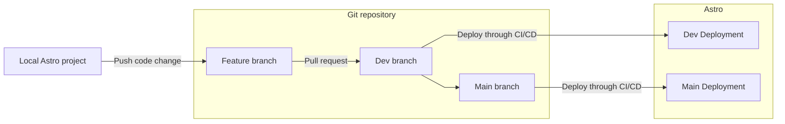
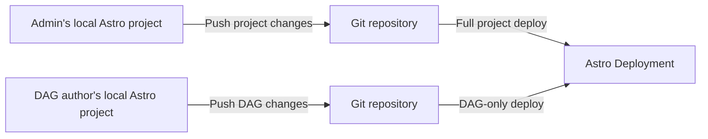
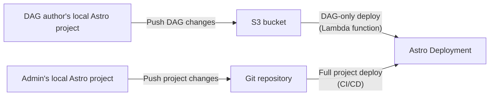

Continuous Integration and Continuous Delivery (CI/CD) pipelines are programmatic workflows that automate key parts of the software development lifecycle, including code changes, builds, and testing. CI/CD helps your organization develop faster, more securely, and more reliably.

There are many strategies for organizing your source code and building CI/CD pipelines, and each has its own benefits and limitations. Use this document to:

- Learn the benefits of CI/CD.
- Determine what kind of Deployment and CI/CD strategy you want your data team to use.

When you're ready to implement your CI/CD strategy, see [CI/CD templates](ci-cd.md) for setup steps and examples.

## Benefits of CI/CD on Astro

On Astro, you can use [Deployment API keys](api-keys.md) to automate your code deploys. Astronomer recommends hosting your Astro project source code in a version control tool, such as [GitHub](https://github.com/) or [GitLab](https://about.gitlab.com/), and setting up a CI/CD workflow for all production environments.

There are many benefits to configuring a CI/CD workflow on Astro. Specifically, you can:

- Avoid manually running `astro deploy` every time you make a change to your Astro project.
- Ensure that all changes to your Astro project are reviewed and approved by your team before they get pushed to Astro.
- Automate promoting code across development and production environments on Astro when pull requests to certain branches are merged.
- Enforce automated testing, which increases code quality and allows your team to respond quickly in case of an error or a failure.
- Configure more granular user permissions by managing access and changes to your Astro project source code in your version control tool.

## Choose a deploy strategy

You can set up CI/CD pipelines to manage multiple Deployments and repositories based on your team structure. Before you create your pipeline, you need to determine how many repositories and branches of your project you want to deploy to Astro.

When deciding on a strategy, keep the size of your data team in mind while answering the following questions:

- How many branches of a project do you want to host on Astro? 
- Do you need to deploy a single production branch to a Deployment, or do you also need to deploy a development branch?
- How many repositories do you want to host your project? Will different parts of your team work on different parts of your project?

Read the following topics to learn which combination of branches and repositories is right for your team. Advanced data teams might follow a custom CI/CD strategy that is not described here and is optimized for a particular use case or team structure. If you're not sure which CI/CD strategy is right for you, contact your customer success representative.

### Single branch vs. multiple branch repositories

When you create a CI/CD pipeline, you first must determine if you want to deploy one or multiple project branches to Astro through CI/CD.

#### Single branch

The most cost-effective way to get started with CI/CD on Astro is to maintain a single Git repository that corresponds to a single Astro project and Deployment.

This method assumes that you have:

- One Astro project.
- One Astro Workspace for your project.
- One Astro Deployment.
- One primary and permanent branch in your Git repository. Astronomer recommends `main`.

With this method, you can configure a CI/CD pipeline that deploys code to Astro every time a change is made to an Astro project file in your Git repository. To deploy a change to your project:

- Test all DAG and Astro project changes locally with the Astro CLI. See [Test and troubleshoot locally](test-and-troubleshoot-locally.md).
- Create a new, temporary branch in your Git repository with the change and open a pull request against the `main` branch for review.
- When the pull request is approved and merged to the main branch, the change is automatically deployed to your Deployment on Astro.

Running all of your data pipelines in a single environment means that you don't have to pay for the infrastructure of multiple Deployments, but it limits your ability to test changes on Astro or on development datasets before they are deployed. Astronomer does not recommend this method for production use cases.

#### Multiple branches

For small to medium-sized data teams running data pipelines in production, Astronomer recommends developing a CI/CD pipeline for multiple branches. With this method, you maintain one Git repository that has permanent branches for different versions of your Astro project. You also have multiple Astro Deployments for each of your branches. If you work at a larger organization, you can adapt this method by creating a Workspace for each team or business use case.

The multiple environment method assumes that you have:

- One Astro project.
- One Astro Workspace for your project.
- At least two primary branches in your Git repository that each represent an environment. Astronomer recommends naming the branches `main` and `dev`.
- At least two Astro Deployments that each host different branches of your project.

This method provides your team with an additional environment on Astro to test before pushing changes to production. Each Deployment can contain separate versions of your code, as well as separate environmental configurations. If you use Snowflake, for example, your development Deployment on Astro can use a virtual data warehouse for development (`DWH Dev`), and your production Deployment can use a different virtual data warehouse for production (`DWH Prod`).

### Single repository vs. multiple repositories

Astro supports deploying DAG code changes separately from project configuration changes. If multiple team members work on a single Astro project, decide whether you need multiple Git repositories to separate their work and permissions.

When you make this decision, keep in mind how many branches of your project to host on Astro. Your CI/CD pipeline can manage deploying multiple branches across multiple repositories. See [Single branch vs. multiple branch repositories](singl-branch-vs-multiple-branch-repositories).

#### Single repository to a single Deployment

The most basic strategy is to have a single Git repository that hosts your entire Astro project. If you have multiple team members working on the project, they all commit to the same repository regardless of what changes they're making. This strategy is recommended if your project configurations are not sensitive and your DAG authors are comfortable making code changes within the context of a larger project, or if you have a single team member responsible for an entire Astro project. 

#### Multiple repositories to a single Deployment

Using a multi-repository CI/CD strategy, you can manage your DAGs in one repository and Astro project settings in another. Use this strategy to ensure that DAG authors and data operators have access only to their own files. 

One limitation of this strategy is that you must keep any local copies of the Astro project synchronized with both repositories in order to test Deployment code locally. Your team members might have inconsistencies in their local environments if they can't access code changes from other team members. Astronomer recommends setting up a `dev` Deployment where DAG authors can see and modify project configurations for testing purposes. 

This strategy requires enabling [DAG-only deploys](deploy-code.md#enable-dag-only-deploys-on-a-deployment) on the target Deployment and setting up your CI/CD pipeline on both Git repositories.

#### S3 bucket and Git repository to a single Deployment

Similar to the multiple repository strategy, this strategy separates the management of DAGs and project configuration. DAGs are stored in an [S3 bucket](https://aws.amazon.com/s3/), while Astro project configuration files are stored in a Git repository. 

If you migrated to Astro from Amazon Managed Workflows for Apache Airflow (MWAA), this strategy is useful for maintaining a similar workflow for DAG authors. You can set up a Lambda function to push DAGs to your Astronomer Deployment whenever DAG files are updated in your specific S3 bucket.

## Create a CI/CD pipeline

The process for creating an Astro CI/CD template includes the following steps:

- Selecting a CI/CD strategy after reviewing this document and the requirements of your team.
- Set up your repositories and permissions based on your CI/CD strategy.
- Adding an Astronomer [CI/CD template](ci-cd.md) to your repositories, or using the Astronomer maintained [`deploy-action` GitHub action](https://github.com/astronomer/deploy-action).
- Modifying the Astronomer template or GitHub action to meet the requirements of your organization. 

If you use GitHub, Astronomer recommends using the Astronomer maintained [`deploy-action` GitHub action](https://github.com/astronomer/deploy-action).(https://github.com/astronomer/deploy-action).

## Test and validate DAGs in your CI/CD pipeline

Astronomer recommends that you pytest all Python code in your DAGs. The Astro CLI includes [pytests](test-and-troubleshoot-locally.md#test-dags-with-the-astro-cli) to validate that your DAGs do not have import or syntax errors. You can implement this parse test with the [Astro CLI](cli/astro-dev-parse.md) or the [Deploy Action](https://github.com/astronomer/deploy-action). The default test may not work on all DAGs, especially if they access the Airflow meta database at runtime. In this case, you can write your own parse test using example pytests provided in the default Astro project.
